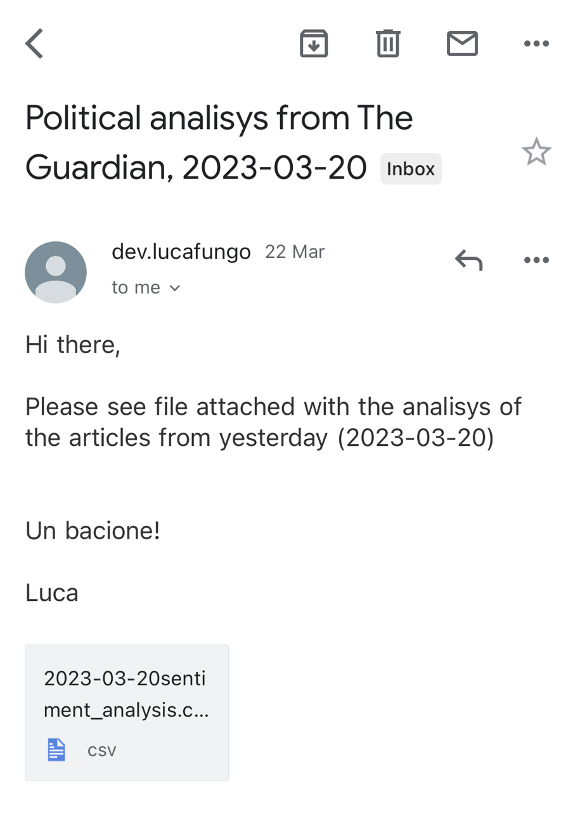

# What-the-Guardian-project

An analisys on how The Guardian express itself about internal politic.

--------------------------------------------------------------------------------------------------------

The project is divide in four script all of them with a specific purpose. 
All the required libraries can be found in the `requirements.txt` file and can be istalled with a `pip command`

```
pip install -r requirements.txt
```

## 1- Api Caller
The first script of this repository execute an API call on `The Guardian` website to get the article of the day before under the topic `politics`. It will store the results in a `.csv` file named `<date-of-yesterday>.csv` in this format:

| WebTitile  |  WebUrl |
| ------------- | ------------- |
|  Article title  | Article link  |


## 2- Article Scraper
The second stage of this repository will scrape the text from the aricles which link are stored in the `.csv` file
generated by the previous script and store them separetly in a new folder created ad hoc.


## 3- Blob Analyser
This script will conduct a sentiment analisy for every single article stored in the folder created by the previous script. 
It will return a score from `-1` to `0` where `-1` it will indicate that the article is critic about the topic and `0` is the highest grade of positivity. At the end, it will save a `.csv` file in the directory  in this format:

| Filename  | Analisys |
| ------------- | ------------- |
| Article title  | Analisys result  |
| Article title  | Analisys result  |
| Avg of the day  | avg  |

## 4- Email sender
The last script in this repository will send the results of the analisys to a given email address




## Contributing

Pull requests are welcome. For major changes, please open an issue first
to discuss what you would like to change.


## Contact

If you have any questions or comments, please feel free to contact me at luca.alfieri@xandertalent.com.

